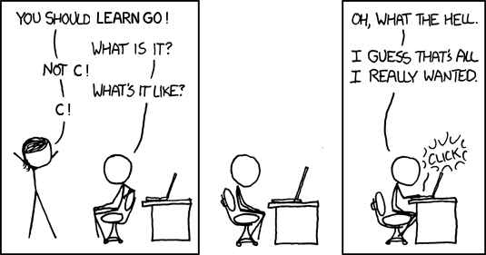

:css: css/talk.css

.. That's the light-background version.

.. Commenting out :css: css/talk_dark.css

..  Swap that in if you want the dark-background version

:title: Go: It Mostly Doesn't Suck
:author: Adam Thornton

Go: It Mostly Doesn't Suck
##########################

Adam Thornton
=============

Speaking As A Private Individual
================================

athornton@gmail.com

----

.. role:: raw-role(raw)
    :format: html

.. role:: strike
    :class: strike

Preliminaries
#############

All software sucks.

I hope to convince you in the next few dozen minutes that Go sucks less than most software.

All hardware also sucks, and all users suck, too, but that's not what this talk is about.

----

tl;dr
#####

Apologies to Randall Monroe

https://xkcd.com/918/

----

You Can Leave Now
#################

That was the important part.

----

Yeah, But What Does That Even *Mean*?
#####################################

If Go feels like **programming**, then...

...C feels like programming naked,

...Python feels like programming with training wheels,

...Perl feels like unicycling naked,

...LISP feels like wielding an elegant weapon for a more civilized age,

...Java feels like programming while wearing mittens,

...COBOL feels like programming while wearing handcuffs and drunk in the back of a police cruiser,

...and PHP feels like punching yourself in the balls over and over.

----

A Slightly Less Pungent Version?
################################

Ways Go is like C (an incomplete list):

- Small: 25 keywords

  - C:

    - ANSI C: 32
    - C99: 36
    - C11: 45

  - Java: 50
  - PHP: 67

- Go is statically typed.
- Ken Thompson and Rob Pike wrote a lot of it.
- It is fundamentally procedural.
- Programming hipsters hate it.

----

But then why not just use C?
############################

Things Go Does Better Than C (an incomplete list):

- No explicit memory management.

- Much better type-safety.

- Very rich set of standard libraries.

- Import dependency management.

- The range operator.

- Interfaces.

- Concurrency.

- Native map type (you may know these as hashes, dicts, or associative arrays).

- A 2006 view of what's cheap and expensive, not a 1975 view.

----

Enough Theory
#############

Hello, World
============

.. code:: go

  package main

  import "fmt"

  func main() {
    fmt.Println("Hello, world!")
  }

----

Line-by-line
############

.. Code:: go

    package main

Select a package; "main" is used for commands.

.. Code:: go

    import "fmt"

Packages each have their own namespace; ``fmt`` is for text formatting.

.. Code:: go

      func main() {

Just like in C, the primary entry point is called ``main()``.  In Go, ``main()`` takes no arguments and returns nothing.

  - If you're wondering, ``os.Argv`` is where the rest of the command line lives.

.. Code:: go

        fmt.Println("Hello, world!")

Println comes from the ``fmt`` package.  It is capitalized (we'll see why later), and adds a newline to the end of its arguments.

.. Code:: go

      }

Closes the function (and ends the program).

----

Packages
########

Standard library is quite robust: math library (including complex and arbitrary precision numbers ), HTTP, regular expressions, JSON and XML encoding, 2D graphics....

No separate header files: the prologue of a Go binary package contains function names and their signatures.

Imports are done on a per-file basis.  That completely obviates the need for

.. code:: c

  #ifndef _GONKULATOR_H
  #define _GONKULATOR_H
  /* Code goes here */
  #endif /* gonkulator.h */

...and unused imports are a fatal compile-time error.

- You will start off by cursing this.
- Within a month you will wonder how you ever lived without it.

----

Packages and Linkers and Stuff
##############################

Oh My
=====

Exported functions' names start with an uppercase letter.

- This is another thing that you will start off with "what kind of Mickey Mouse crap is this?" and within a month you will just accept it as a totally reasonable convention.

Everything is statically linked.

- Well, kinda.  If you use cgo, you're linking to libc, and on OS X you have three system libraries.

- No dependency hell.

- Yes, executables are big; but disk space is cheap now and it's not like you have to move a 20MB file from place to place across a 300-baud modem link, right?

- This does mean that if you are using a buggy library, you need to rebuild and redeploy.  Go works well in a rebuild-the-world sort of environment, and less well in a traditional patch-the-things setting.

----

Remote Imports
##############

.. role:: strike
    :class: strike

.. code:: go

  import (
    "github.com/gonkulator/libkv/store"
  )

The dependency fetcher (``go get``) is smart enough to know that github uses git.  It knows about Bitbucket, GitHub, :strike:`Google Code Project Hosting`, Launchpad, and IBM DevOps Services.

You can also define private repositories, using any of Bazaar, Git, Mercurial, or Subversion.

- If you're still using CVS, may God have mercy on your soul.

----

Namespace Collisions
####################

.. code:: go

  import (
    "crypto/tls"
    aztls "github.com/Azure/azure-sdk-for-go/core/tls"
  )

Refer to the standard TLS package as "tls" and Azure's as "aztls".

Package functions are always referred to as package dot function.  So you're free to have both:

::

  math.Tan()
  salon.Tan()

- So you can't have the case where you call ``Tan()`` and it runs the one from the ``salon`` package when you thought you were calling the ``math`` one.

- Or ``redefinition of 'Tan'``.

- Since all dependencies are explicit and done at the file level, you also can't get into the situation where the app depends on version ``1.2.16`` of ``log4j``, but one of its other dependencies imported version ``1.2.11`` before your import happened.  Not that this has ever happened anywhere I ever worked.

----

Dependency Versioning
#####################

This is one of the things you're going to hear programming hipsters hate on Go about.  They have a point.

``godep`` is pretty dreadful, actually.

I haven't used ``glide``.

The ``GO15VENDOREXPERIMENT`` didn't really work.  Not all experiments do.

``gopkg.in`` is amusing.  It uses git tag conventions to redirect an import of ``gopkg.in/user/pkg.v3`` to ``github.com/user/pkg`` with tag ``v3`` or tag ``v3.x`` or ``v3.x.y``.  That's still pretty hinky and ad-hoc, though.

But anyone who insists super-stridently about this is blowing smoke and concern trolling you anyway.  It's definitely Not That Terrible.

----

Things You Will Miss
####################

No REPL loop.

- You can use the Playground at golang.org, or set up your own playground, but it isn't the same.

- On the other hand, building is really quite fast, and "go run" comes close.  It's still not really having a REPL loop.

No optional arguments.

- Pointer arguments, and ``nil`` acting as "no argument," is the common idiom, but feels gross.

----

Things You Might Miss
#####################

Generics.

- Go isn't Java.  Or C++.

- ``go generate`` actually lets you build a regex-based generics system, if you insist.

Preprocessor macros.

- Function calls are pretty fast these days; it isn't 1978 anymore.

- ``go generate`` actually lets you build a preprocessor macro expansion system, if you insist.

----

Things You Won't Miss
############################

C:

 - Pointer arithmetic.

 - ``malloc()``, ``free()``.

 - ``#ifdef`` guards.

Java:

 - FactoryDBConnectorFactoryAbstractFactoryImplementorFactorySetterFactoryGeneratorFactory()

 - Working in a language that Oracle only resentfully supports.

  - P.S. Larry Ellison hates you.

PHP:

 - Everything.

----

The Best Thing About Go
##################################

I'm not sure how to define this crisply, but:

In Go, the gap between having a program that compiles and a program that does what I want it to is consistently much smaller than it is in any other language I've used, and I've used a lot of languages.

----

If You're Not A Programmer Yet But Would Like To Learn
######################################################

I think Go would be a pretty good first language.

It would be an even better second language.  Python is more approachable and forgiving.  But when you're ready to take the training wheels off, here are some nice features.  They should look familiar:

- Built-in maps.

 - Other languages may call these things hashes, dicts, or associative arrays.  Whatever you call them, they're wonderfully useful.

 - Small number of keywords and sane syntax makes it easy to keep in your head, and you can probably read other people's Go (I'm looking at *you*, Perl).

----

Basically Imperative
####################

- Go doesn't try to cram functional programming down your neck when you're still getting the hang of imperative programming (I'm looking at *you*, Javascript).

- Object orientation and concurrency are mostly orthogonal to the rest of the language, although somehow without feeling bolted-on the way they do in, say, Perl.

 - You can learn them when you're ready.

 - You can still write perfectly reasonable and idiomatic programs without them first.

----

Also Nice For The Novice
########################

The built-in github-friendliness and autogeneration of documentation helps to create a particular culture around Go code that is made public.

- That culture values lucid and concise over either:

 - clever and incomprehensible, or

 - prolix, repetitive, and boring.

----

Unicode Support
###############

There's a ``unicode`` package.

Strings are Unicode already.  But really they're byte arrays.

Mostly it just works.  At least I haven't had to think about it much.

----

Arrays and Slices
#################

Arrays have a specific fixed length.  Slices can grow and shrink.  Each one is sequential storage for elements of a particular type.

This is one of the confusing bits of Go, and it's hard to address in a short talk.  You get used to it pretty quickly.

Slices support indexing; the index intervals are half-open, like Python:

.. code:: go

    import "fmt"
    //...
    l := []string{"a","b","c","d"}
    fmt.Printf("%v\n",l[0:2]) // [a b]
    fmt.Printf("%v\n",l[:2])  // [a b]
    fmt.Printf("%v\n",l[2:4]) // [c d]
    fmt.Printf("%v\n",l[2:])  // [c d]
    fmt.Printf("%v\n",l[:])   // [a b c d]
    // BUT:
    // fmt.Printf("%v\n",[:-1]) yields ...
    // invalid slice index -1 (index must be non-negative)
    // Go isn't Python.
    fmt.Printf("%v\n",l[:len(l)-1]) // [a b c]

----

Maps
####

Maps: just like Perl hashes or Python dicts.

- The only tricky bit is that you have to allocate space for them first.

.. code:: go

	var m map[string]string
	m["foo"] = "bar"
	fmt.Printf("%+v\n",m)

- Yields ``panic: assignment to entry in nil map``

- You need:

.. code:: go

  m := make(map[string]string)
  m["foo"] = "bar"
  fmt.Printf("%+v\n",m)

- Yields ``map[foo:bar]``

----

More About Maps
###############

A map key must be a comparable type.  A value can be any type.

- Comparable types:

  - Boolean
  - Integer
  - Floating Point
  - Complex
  - String
  - Pointer
  - Channel
  - Interface
  - non-interface type X and interface T if X is comparable and X implements T
  - Structs if all fields are comparable
  - Arrays if values of the array type are comparable

- Non-comparable (except to nil):

  - Slice
  - Map
  - Function

tl;dr sane map keys are going to work (and many insane keys).

 - See https://golang.org/ref/spec#Comparison_operators

----

Structs
#######

A lot like C.

.. code:: go

  type Employee struct {
      Firstname string
      Lastname  string
      Salary    float64 // We have grand ambitions
      Title     string
  }

Access fields with a dot.

.. code:: go

  var e Employee
  e.Title="Yes-Man, Third Class"

----

Embedded Structs
################

Sort of like an inheritance-by-composition model.

.. code:: go

  type Name struct {
    Firstname string
    Lastname  string
    Middlename string
    Suffix string
  }
  type Employee struct {
    Name
    Salary float64
    Title string
  }
  var e Employee

You can still refer directly to ``e.Firstname`` (you can also say ``e.Name.Firstname``)

(https://golang.org/doc/effective_go.html#embedding)

----

Unit Testing
############

A little like Perl's test framework.

- It must have a filename of ``whatever_test.go`` in the same directory as ``whatever.go``.

- Usually should be in the same package as ``whatever``, but sometimes it's handy to not do that; for example, if you want to only test exported functions.

- Any function named ``TestXxx``, where ``Xxx`` is any alphanumeric string that doesn't start with a lowercase letter, gets run.  The signature looks like ``func TestXxx(*testing.T)``.

- There are also ``BenchmarkXxx`` and ``ExampleXxx`` functions.

Run it with ``go test``.

https://golang.org/pkg/testing/

----

A Little Tour Of Unusual Go Features
####################################

There are some things Go does that aren't much like C at all.  Here are a few:

- Multiple return values

- Goroutines / Channels

- Interfaces / Object Model

- ``defer``

- Error handling / Exceptions

----

Multiple Return Values
######################

This is most commonly seen as:

.. code:: go

  var err error
  var s string
  // ...
  if somethingWentWrong() {
    return "",fmt.Errorf("something went wrong")
  }
  return "bob's yer uncle", nil

But you are free to return multiple values of any type:

.. code:: go

  func WeirdReturner(f float) (int, rune, *map[string][]float, error) {
    ...
  }

----

Goroutines
##########

Go's concurrency support is in the runtime.  It uses things called goroutines (from "coroutines"), which are pretty much threads, but don't require OS support.

- Memory is shared, so you are responsible for doing your own mutex stuff (it's in the ``sync`` library).

- You start a goroutine with: ``go RunSomething()`` or with an anonymous closure: ``go func() { ... }``

- If you just want it to run, great, you're done (goroutines will exit when the main function exits).

- For synchronization, you can use ``sync.Waitgroup``, or use channels.

- There is an excellent page on this at: https://divan.github.io/posts/go_concurrency_visualize/

----

Channels
########

Go's channels are a synchronization mechanism.  A channel passes a particular type of value.

.. code:: go

    i := make(chan int)        // Unbuffered
    s := make(chan string, 3)  // Capacity of three strings
    i <- 1                     // Write to channel
    r := <-s                   // Read from channel

Typically you'd use multiple channels in a ``select`` loop, which looks just like a ``select()`` loop in C or old-school Perl or whatever:

.. code:: go

    for {
        select {
            case m :<- c1:
                HandleC1(m)
            case m :<- c2:
                HandleC2(m)
            // ....
        }
    }

See https://talks.golang.org/2012/waza.slide

----

Interfaces
##########

This is how you get polymorphism in Go:

- A type supports particular methods.

- An interface is a collection of methods.

- Anything that supports all those methods therefore implements that interface.

----

Type Declaration
################

Most of the types you declare will probably be either array or struct types.  Like so:

.. code:: go

    type Userlist []string
    type Employee struct {
        Firstname string
        Lastname  string
        Salary    float64 // We have grand ambitions
        Title     string
    }

----

Type Methods
############

Look just like function definitions, except they have another parameter before the function name.

.. code:: go

    func (e *Employee) ChangeTitle(title string) string {
        // Needs to be a pointer to Employee because we are modifying it.
        oldtitle := e.Title
        e.Title = title
        return oldtitle
    }

----

Interface Definition
####################

An interface is just a set of type methods that an object must provide.

.. code:: go

    type Stringer interface {
        String() string
    }

The various fmt.Printf variations use an object's String() method, if it exists, to display the textual representation of an object.  If it doesn't have one, you just get the list of fields in order.  Let's add Stringer to Employee.

----

Interface Definition Example
############################

.. code:: go

    import "fmt"
    e := Employee{
        Firstname: "Edna",
        Lastname: "Schultz",
        Title: "Director of Something",
        Salary: 91532.20,
    }
    fmt.Println("Employee: %v\n",e)

Yields: ``Employee: {Edna Schultz 91532.2 Director of Something}``

That's ugly and we don't want to display the salary when we print the object.  So let's add a ``String()`` method:

.. code:: go

    func (e Employee) String() string {
        s := e.Lastname + ", " + e.Firstname + " [" + e.Title + "]"
        return s
    }

Now we get ``Employee: Schultz, Edna [Director of Something]``, which looks a lot better.

----

``defer``
#########

``defer`` is the best thing since sliced bread.

When you ``defer`` a function, you are saying: when you exit this function, whether normally or via a ``panic()`` (we're getting to those next), run the deferred function.

- ``defer`` statements are run in reverse order of declaration (that is, LIFO).

- Arguments are evaluated when the ``defer`` statement is encountered.

.. code:: go

    bucket, err := couchbase.GetBucket(Bucketname)
    if err != nil {
        // Complain, and then...
        return err
    }
    // If we got here, we have a bucket.  We want to close it when we exit,
    //  however we exit
    defer bucket.Close()
    // ... do stuff with the bucket
    return nil

This makes it ever so much easier to remember to clean up resources when you're done with them.

----

Errors and Exceptions
#####################

Go is not Java.  In general, you want to return an error, not throw an exception.

Functions can return multiple values, so a function signature that returns a result and an error is a very common idiom.

An error is a built-in type.

- As it happens, it's an interface type:

.. code:: go

    type error interface {
        Error() string
    }

So you're free to define your own with more structure if you like (HTTP is a good example).

----

Using Errors
############

.. code:: go

    import "fmt"
    func Scarborough(arg string) error {
        switch string {
            case "parsley", "sage", "rosemary", "thyme"
                return nil
            default:
                return fmt.Errorf("ingredient '%s' not Simon-and-Garfunkel approved",arg)
        }
    }

Typical calling convention is:

.. code:: go

    err := Scarborough(arg)
    if err != nil {
        fmt.Printf("Guess *you're* not going to Scarborough Fair: %v",err)
    }

----

Exceptions
##########

Exceptions are *exceptional*.  Errors are not generally exceptional.

``panic(s)``

A ``panic`` in function ``F`` does the following:

1. Stops execution of ``F``.

2. Executes all of ``F``'s deferred functions.

3. Returns to the caller of ``F``.

4. Acts as if ``F`` had been a call to ``panic``.

----

Recovering from Panic
#####################

``recover`` only works inside a deferred function.  It catches the ``panic`` value (a string) and returns it.

If a ``panic`` reaches the top of a goroutine's call stack, the program exits and prints a stack trace.

The standard library package ``json`` contains a good example of this.

In general, you'd only recover a panic inside a library, because you generally want to return an error rather than destroy your caller's program.

----

Some Random Language Nerd Things
################################

Functions are first-class objects.

- This also makes dispatch tables really easy.

You can use anonymous functions to make closures.

Go supports reflection, so you can do type introspection.

- The only time I've actually needed this in the wild was to get some non-exported fields out of an opaque data type, which I could safely do only because I understood the problem domain and knew that my private certificate would always really be an RSA certificate.

- If you find yourself using ``reflect`` much, or the ``unsafe`` package, and you're not writing some sort of decoder/parser/unmarshaller thing, you are probably doing it wrong.

----

Editor Support
##############

There appears to be editor support for the major editors, by which I mean:

- Emacs (my choice)

- Atom (my other choice)

- Vim (if you swing that way)

- Brackets (if you're a Web Design Hipster)

- Eclipse (if you can't turn loose of Java)

- Sublime (if you want something like Atom and hate saving money)

- Nano/Pico/Joe/Gedit (if you don't like learning editors)

- BBedit (if you have a Mac and hate saving money)

- Visual Studio (what's wrong with you?)

- Notepad++ (no, really, go see a doctor)

- ... (https://github.com/golang/go/wiki/IDEsAndTextEditorPlugins)

I can vouch for Emacs and Atom.  For the most part Go support doesn't ship with the editor and you will have to install a plugin to get it.

----

Code Style
##########

Brilliant Gordian Knot solution.

- There's only one way to do it.

- ``go fmt``

Set your editor to display tabs at a width you like, let the editor mode deal with it, and set up the environment to run ``go fmt`` on save.

----

Godoc
#####

https://blog.golang.org/godoc-documenting-go-code

Basically, put a comment immediately before the function, with no intervening space, make sure that it starts with the name of the thing it's describing, and if it is on Bitbucket, GitHub, or Launchpad, then the first time anyone looks for it by import path, the documentation is autogenerated.

----

Cute Logo
#########

.. image:: images/gophercolor.png
  :height: 600px

Gopher from golang.org, designed by Renée French, licensed under Creative Commons Attribution 3.0 License.

----

Oh, And There's This
####################

Google it as ``golang`` rather than ``go`` or you will be sad.

----

Larger Example, Depending On Time
#################################

Let's write a thing.  Who wants to write a what?

----

This Talk
#########

https://github.com/athornton/go-it-mostly-doesnt-suck.git

----

Questions?
##########

Not like I have answers.  But I'll do my best.

Adam Thornton

athornton@gmail.com
